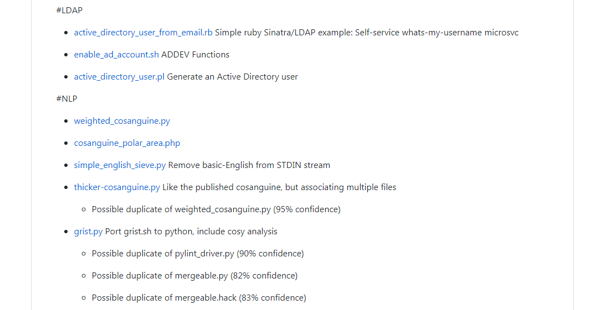

# gRist

> Without libraries what have we? We have no past and no future.  
> –Ray Bradbury


## Whats this?

gRist is a simple python script for indexing a user's GitHub gists.  

gRist:

* Generates a single gist with an index of all other gists by description (or gist name if the description field is empty).  
* Attempts to categorize gists based on hashtags found in the 0th-comment.
* Attempts to flag duplicated gists (cosine similarity of content > 80%).  


## What's the point? GitHub already offers a list of all your gists and there are clients for phones.

GitHub absolutely offers a list of gists in their web interface, but the author finds the 30-gists-per-page limit frustrating in the face of his 500+ gist collection and no mobile client offers a table of contents.

The author is a cumpulsive note taker who is beaing weaned off-of Google Keep.


## Got a screenshot?




## How would I run this?

Create a gist named index.md
Consider starring this gist so it isn't easily misplaced 
Stow an API token blessed for 'gist' access somewhere safe-ish and update the ```token_file``` assignment at the top.


## Known issues

The author's workflow is one-file-per gist, YMMV if you include multiple files in a single gist.
